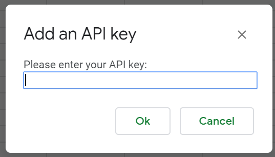

Adding an API key to Sansheets is very simple. But there is two things
you need to do first:
- [Getting Sansheets ready](/sansheets/getting-started/setting-up/)

and
- [creating an API key](https://sheets.santiment.net/account#api-keys).

In case those are
already done you can continue adding that API key to Sansheets.

You will find the option to add an API key in the **`Add-ons`** menu
under **`Santiment Data`**:

A popup will open asking you for your API key:

Copy it from the Sanbase account settings and paste it here, then click
`Ok`.

Sansheets will now confirm that you entered a valid API key:

You will now have access to more data, depending on your stake of SAN
tokens.
